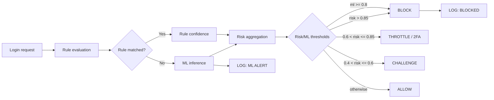

# EaglePro: Complete Brute-Force Detection System

## Overview

EaglePro implements a complete 4-layer brute-force detection system:

1. **Rule-based Detection** - Fixed rules for immediate response
2. **ML-based Detection** - Binary classification (attack vs benign)
3. **Attack Classification** - Multi-class ML (attack type identification)
4. **AI Response Agent** - Automated response strategies

## Architecture

```
Login Events → Rule Engine → ML Binary → ML Multi-class → Response Agent
     ↓            ↓            ↓            ↓              ↓
   Raw logs    Immediate     Attack?     Attack type    Actions
              blocking      detection   classification  (block/alert/2FA)
```

## Components

### 1. Rule-based Detection (`detection_system/rule_based/`)

**Rules:**
- `rapid_bruteforce.json`: IP-level rapid attempts (>10 fails/30s, >0.5 attempts/sec)
- `credential_stuffing.json`: Multi-user attacks from single IP (>5 users, >5 fails/5m)
- `distributed_attack.json`: Multi-IP attacks on single user (>8 IPs, >50 fails/5m)

**Features:**
- Sliding window metrics (30s, 5m, 1h)
- Cooldown periods (set to 0 for training)
- Staged responses (alert → throttle → block)

### 2. ML Binary Detection (`ml/`)

**Model:** Logistic Regression
**Features:** 15 sliding-window metrics (IP, user, pair scopes)
**Performance:** Precision 1.000, Recall 0.991, F1 0.995

### 3. ML Attack Classification (`ml/`)

**Model:** Multi-class Logistic Regression
**Classes:** benign, rapid_bruteforce, credential_stuffing, distributed_attack, targeted_slow_low
**Performance:** 100% accuracy on test set

### 4. AI Response Agent (`agent/`)

**Strategies:**
- `rapid_bruteforce`: Block IP for 5 minutes
- `credential_stuffing`: Require 2FA for affected users
- `distributed_attack`: Admin alert + 1-hour monitoring
- `targeted_slow_low`: 2-hour monitoring only

**Features:**
- Periodic monitoring (default 5 minutes)
- State management (blocked IPs, 2FA requirements, alerts)
- Automatic cleanup of expired responses

## Usage

### Training Pipeline
```bash
# Build features from NDJSON
python scripts/run_ml.py build

# Train ML models
python scripts/run_ml.py train

# Evaluate vs rule-based
python scripts/run_ml.py evaluate
```

### Classification Demo
```bash
# Classify dataset
python scripts/run_classification.py dataset --dataset data/test_events.ndjson --limit 10

# Classify single event
python scripts/run_classification.py single --event '{"timestamp":"2026-03-09T10:00:00Z","username":"user1","src_ip":"192.168.1.1","success":false}'

# Dataset statistics
python scripts/run_classification.py stats --dataset data/test_events.ndjson
```

### AI Response Agent
```bash
# Run once on test data
python scripts/run_agent.py --dataset data/test_events.ndjson --once

# Continuous monitoring (every 5 minutes)
python scripts/run_agent.py --dataset data/test_events.ndjson
```

## Quick start + flowchart

### Quick-start 1-liner

```bash
python scripts/setup_database.py && python scripts/run_web.py
```

### Overview flowchart



## Performance Results

### Rule-based vs ML Comparison
| Metric | Rule-based | ML Binary | ML Multi-class |
|--------|------------|-----------|----------------|
| Precision | 0.997 | 1.000 | N/A |
| Recall | 0.985 | 0.991 | 100% |
| F1 | 0.991 | 0.995 | N/A |

### Attack Type Detection Rates
- `rapid_bruteforce`: 94.7%
- `credential_stuffing`: 99.5%
- `distributed_attack`: 94.4%

## Key Innovations

1. **Hybrid Detection**: Rules for speed, ML for sophistication
2. **Attack-aware Responses**: Different strategies per attack type
3. **Stateful Agent**: Maintains response state across monitoring cycles
4. **Zero Cooldown Training**: Rules tuned without cooldown for better labeling

## Files Structure

```
eaglepro/
├── agent/                           # AI Response Agent
│   ├── core/                        # Core agent functionality
│   ├── processing/                  # Event processing
│   └── README.md
├── classification/                  # ML Classification demos
│   ├── core/                        # Classification logic
│   ├── demo/                        # Demo modules
│   └── README.md
├── data_generator/                  # Synthetic data generation
│   ├── core/                        # Core generation logic
│   ├── patterns/                    # Attack patterns
│   ├── scenarios/                   # Scenario configurations
│   └── README.md
├── detection_system/rule_based/     # Rule engine
├── ml/                              # ML models & training
│   ├── core/                        # Training and inference
│   ├── features/                    # Feature engineering
│   ├── evaluation/                  # Evaluation utilities
│   └── README.md
├── scripts/                         # Training & evaluation scripts
├── data/                            # Generated datasets
├── models/                          # Trained ML artifacts
├── reports/                         # Evaluation reports
└── README.md                        # This file
```

## Future Enhancements

- Real-time streaming integration
- Advanced ML models (Random Forest, Neural Networks)
- User behavior modeling
- Integration with SIEM systems
- Adaptive threshold tuning
4. **ML**: Build feature, train, so sánh ML vs rule bằng [scripts/run_ml.py](scripts/run_ml.py) (xem [ml/README.md](ml/README.md)).
5. **Web**: Chạy [web_app/app.py](web_app/app.py); detection rule-based chạy real-time khi login (xem [web_app/README.md](web_app/README.md)).

---

## Dev housekeeping

- Đã xóa file tạm: `tmp_import_test.py`.
- Đã xóa folder không dùng: `web_app_old`.
- Đã xóa báo cáo cũ: `WEB_APP_COMPLETE_FIX.md`, `WEB_APP_FIX_REPORT.md`.
- Các tệp cốt lõi vẫn còn:
  - `scripts/` (setup, run, trigger)
  - `database/` (schema, sample_data.sql)
  - `models/` (artifact ML: binary_model, multiclass_model, scaler, metadata)
  - `web_app/` (app logic và route)

Lưu ý: khi clone repo mới, chỉ cần chạy `python scripts/setup_database.py` để tạo schema + sample data, rồi `python scripts/run_web.py` để start web.

---

## Tài liệu chi tiết từng phần

- **[agent/README.md](agent/README.md)** — AI Response Agent architecture, usage, and integration.
- **[classification/README.md](classification/README.md)** — ML Classification module, demos, and API.
- **[data_generator/README.md](data_generator/README.md)** — Synthetic data generation, patterns, and scenarios.
- **[ml/README.md](ml/README.md)** — ML pipeline: features, training, inference, and evaluation.
- **[detection_system/README.md](detection_system/README.md)** — Rule-based (aggregator, rule_loader, rule_evaluator), rules JSON, ML gateway.
- **[web_app/README.md](web_app/README.md)** — App, routes, detection_integration, models, config, templates.
- **[scripts/README.md](scripts/README.md)** — run_generator, run_rulebase, run_ml, setup_database.
- **[database/README.md](database/README.md)** — Schema, bảng, mối quan hệ.
